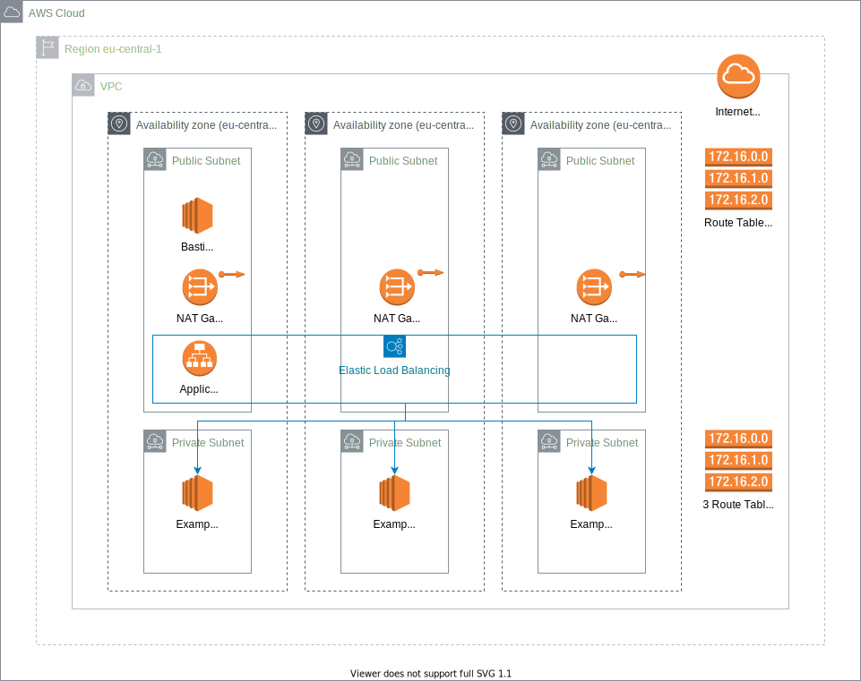

# CloudFormation AWS Demo

This git repository contains infrastructure as code (cloudformation) to deploy a common architecture to AWS. It creates a public and private network, a bastion host to connect to your private instances and an example application behind a loadbalancer. 

## Overview

What we will build:


## Prerequisites

- AWS account
- AWS cli installed

## Usage

I devided this project into 3 parts:
1. create resources for the base infrastructure
2. create resources for an example application
3. create resources for a bastion host connect

### 1. Creating infrastructure in AWS
File: 01-cf-base-infrastructure.yaml

This template creates following resources:
- VPC
- 3 private networks (1 for each availability zone in given region)
- 3 public networks (1 for each az as well)
- Internet Gateway
- Nat Gateway in each zone

```bash
aws --region eu-central-1 cloudformation deploy --stack-name=cf-demo-base --template-file=01-cf-base-infrastructure.yaml
```

### 2. Create example app in AWS
File: 02-cf-example-app.yaml

This template creates 3 ec2 instances and a loadbalancer as an example.

```bash
aws --region eu-central-1 cloudformation deploy --stack-name=cf-demo-app --template-file=02-cf-example-app.yaml
```

### 3. Create bastion Host
File: 03-cf-bastion-host.yaml

This template creates an ec2 instance with SSH access from the internet to connect to the private instances.

```bash
aws --region eu-central-1 cloudformation deploy --stack-name=cf-demo-bastion-host --template-file=03-cf-bastion-host.yaml
```

### Cleanup

To cleanup your aws cloudformation stacks execute following commands:

```bash
aws cloudformation delete-stack --stack-name=cf-demo-app --region eu-central-1
aws cloudformation delete-stack --stack-name=cf-demo-base --region eu-central-1
aws cloudformation delete-stack --stack-name=cf-demo-bastion-host --region eu-central-1
```
